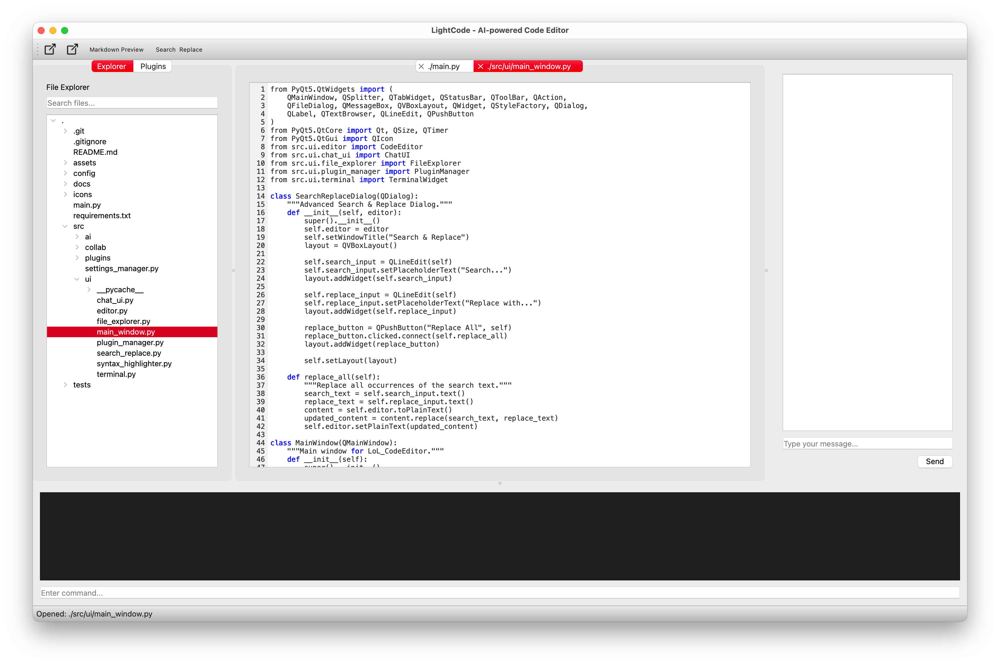

# LoL_CodeEditor - AI-powered Code Editor



LoL_CodeEditor is a high-performance, AI-powered collaborative code editor built with Python. It offers real-time collaboration, advanced code intelligence, syntax highlighting, and integrates a suite of developer tools such as chat-based interaction, a file explorer, terminal access, and search & replace features. Designed for speed and efficiency, LoL_CodeEditor ensures minimal startup time and low memory usage.

---

## Features

- **Real-time Collaboration**: Uses optimized CRDTs to enable seamless real-time collaboration.
- **AI-based Code Intelligence**: Autocompletion, error detection, and code refactoring using AI models.
- **Syntax Highlighting**: Multi-language support with real-time syntax highlighting.
- **Integrated Chat Interface**: Chat with AI or collaborate through the embedded chat window.
- **File Explorer**: Fast and searchable file navigation with lazy folder loading.
- **Search & Replace**: Powerful global and inline search & replace tool.
- **Terminal Access**: Built-in terminal to execute shell commands within the editor.
- **Plugin Manager**: Load and manage plugins to extend functionality.
- **Markdown Preview**: Live preview of markdown content in a separate tab.
- **Autosave**: Automatic saving of open files to prevent data loss.

---

## Installation

1. **Prerequisites**
   - Python 3.8+
   - PyQt5: Install using the following command:
     ```bash
     pip install PyQt5
     ```

2. **Clone the Repository**
   ```bash
   git clone https://github.com/himudigonda/LoL_CodeEditor.git
   cd LoL_CodeEditor
   ```

3. **Run the Application**
   ```bash
   python main.py
   ```

---

## File Structure

```plaintext
LoL_CodeEditor/
├── assets/               # Icons and UI assets
├── main.py               # Main entry point for the application
├── src/
│   ├── plugins/          # Plugins folder
│   └── ui/               # UI components
│       ├── chat_ui.py
│       ├── editor.py
│       ├── file_explorer.py
│       ├── plugin_manager.py
│       ├── search_replace.py
│       └── terminal.py
```

---

## Usage

1. **Opening Files**: Use the file explorer or `Ctrl + O` to open files.
2. **Creating New Files**: `Ctrl + N` opens a new untitled tab.
3. **Search & Replace**: Open the search dialog via the toolbar to perform search and replace.
4. **Chat Interface**: Use the embedded chat on the right panel to interact with AI or collaborators.
5. **Terminal Access**: Run shell commands directly using the terminal widget at the bottom.
6. **Markdown Preview**: Open the markdown editor and preview your content live in separate tabs.

---

## Key Shortcuts

- **Ctrl + N**: New file
- **Ctrl + O**: Open file
- **Markdown Preview**: Available via the toolbar
- **Search & Replace**: Access through the toolbar
- **Tab Close**: Click the close icon or confirm on `X` button press

---

## Customization

- **Adding Plugins**: Add new Python scripts to the `src/plugins/` folder.
- **Syntax Highlighting**: Modify `MultiLanguageHighlighter` to extend language support.

---

## Future Plans

- **Ollama Integration**: For enhanced code suggestions and completion.
- **Enhanced Collaboration**: Implement collaborative cursors and live editing indicators.
- **Theme Support**: Add support for multiple editor themes.

---

## Troubleshooting

- **Permissions Issue**: If a directory is not accessible, you will receive a permission warning.
- **File Not Found**: You will be notified if a file was deleted or cannot be accessed.

---

## Contributing

We welcome contributions! Please open a pull request or submit issues on GitHub for any bugs or improvements.

---

## License

This project is licensed under the MIT License.

---

## Authors

Developed by Himansh Mudigonda and contributors.
